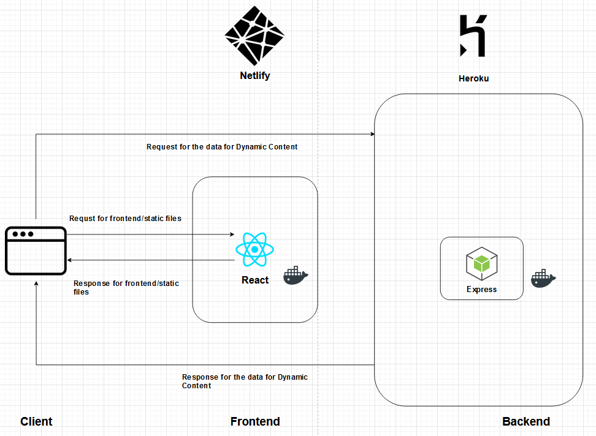

# Tech Stack and Toolchain

When deciding on a tech stack to use for this project, we took into account everyone’s experiences and expertise from various past projects and jobs. We discussed which languages and frameworks each team member has previously used and is comfortable with. Each of us had a variety of tools and technologies that we were comfortable with and there was nice overlap between team members.This was an advantage for the team as we could split up some work between pairs of team members if needed, and also we would be able to carry on in the worst case scenario of a team member dropping our or not being able to work for a certain period of time. We understand that the latter can occur since all team members have different work loads and schedules, so we will still be able to efficiently complete tasks. It will also allow us to properly discuss, plan, and design certain parts of the project without having a single team member make decisions without input from others.
 
Further, we looked at each team member’s learning goals for this project and made sure that they were all satisfied. Some team members wanted more experience with certain frameworks and tools so that was taken into consideration. Another point that was brought to the table was the hardware everyone had access to. In the end, every team member was able to work with hardware that was powerful enough for the development and testing of the planned project, whether it was a personal computer, or access to a lab computer or server.
 
One more thing that we considered when choosing and planning the tech stack was the client and their integration needs. Since we will be connecting to an open source endpoint and using a standardized API, there are no specific frameworks we need to choose over others in this regard.
 
The main components of the tech stack that we discussed were containerization, backend, frontend, testing infrastructure, and CI/CD. They are discussed in more detail below.

  

### Container (Docker)
To containerize our project, we decided to use Docker. Docker is the most popular, if not the best, container technology available out there. Compared to using VM technologies such as Vagrant, Docker is more lightweight, starts faster and offers the option to be integrated into our CI/CD pipeline. Moreover, Docker is accessible on Windows, Mac and Linux, so the project will most likely run on the client’s development environment. More importantly, every member of the team has some experience with the tool in previous courses and work experiences. This ensures that we can finish the project even if someone in the team drops the course and that we will not have to spend a huge amount of time learning how the tool works and can focus on other technical parts of the project. 
 
### Backend (Express)
For the backend, we picked ExpressJs as the main framework. We chose JavaScript over other languages not only because it’s simple and has less boilerplate code, but also because it reduces context switching since we also use JavaScript for our frontend. As the most popular JavaScript backend framework, Express is fast and lightweight. It gets the job done with just a few lines of code. Creating middlewares and customized routing with express is extremely easy. With many useful prebuilt middlewares to validators, developers can save lots of time to build their own parsing and validating logic. Express also works pretty well with any ORMs and frontend libraries which make the workflow easier. We also put other options like Java Spring Boot, Nest.js and Flask/Django into our consideration. However, most of them are either not written in Js or have a higher learning curve for the whole team. Overall, Express’s simplicity, ecosystem, popularity and the fact that it fits the team's skill set makes it the best choice.
 
### Frontend (React)
For frontend, we choose to use React because of its maturity of ecosystem and ease-of-development.
 
#### Comparison with other frontend technology
We'll mainly compare these three frontend options: React, Vue, and Angular.
- Popularity: Widespread Usage
  - According to StackOverflow 2020, React.js is the second most popular web framework among all, as more than 35% of respondents use React.js.
  - Compared to React.js, other famous frameworks such as Angular.js, Vue.js, Spring have less users.

| Web Framework | Popularity (collected from Stackoverflow 2020 suryvey) |
| --- | --- |
| React.js | 35.9% |
| Angular | 25.1% |
| Vue.js | 17.3% |
| Spring.js | 16.4% |

#### Vue vs React
- Domain Covered
  - React and Vue are terrific frameworks that can be applied on both frontend and backend.
- Ease of Development
  - Although with clearer documentation and an easy learning curve, Vue is easy for beginners to learn. It's also easier to get accustomed to because it picked out the advantages of React and Angular.
  - However, both my teammates and I are more familiar with React. Working with technology that we are familiar with would be helpful for debugging and implementation.
- Maturity: React has broader package ecosystem
  - Vue has fewer resources, available packages and third-party libraries.
  - Both Vue and React gain support from all major IDEs, while React is more extensive.
  - React features a huge ecosystem and an extremely active community, which is convenient. That is to say, it contains a huge amount of libraries, packages, and tools. That is to say, we may easily find a solution or an extra package to fix the problem we encounter.
- Scalability: Reusing Component in React
  - React is more scalable since it uses JSX which allows reusing components in the code. Thus the code structure is neat and clean. Both HTML and CSS are expressed via JavaScript with XML syntax.
  - Vue uses HTML templating with a single file component. When we are developing a large project, reusing HTML templates is a huge pain and is nasty.
- Performance
  - Rendering Child Component In React
    - Vue prevents unnecessary renders of child components by tracking dependencies.
    - While in React, if a component state is modified, then all the child components of this parent component will be re-rendered. This will cause some lag in running speed.
  - Vue Has built-in Server Side Rendering
    - React needs third-party libraries assistance to implement server side rendering. However, Vue has in-built Server side rendering capabilities which is very convenient.
 
#### Angular vs React
- Domain Covered
  - React and Angular are both suitable for web and mobile development. And they both require additional framework for mobile development, which are React Native and NativeScript respectively. And they both support single-page and multiple-page web applications. They are well-matched in domain covered.
- Ease of Development
  - React is more easy to learn and angular is new to us.
  - With basic knowledge, the framework of React is much simpler to understand. React is minimalistic, which does not have complicated features and dependency injection.
  - Angular possesses a huge library and it uses TypeScript and it's constantly updated. The syntax and component management is also intricate, thus Angular requires extra learning effort.
- Language
  - Angular supports both JavaScript and TypeScript. TypeScript is more compact than JavaScript which is easier for code refactoring and debugging.
  - React uses JSX script and it helps JavaScript resemble the code written in HTML. It makes the code more readable and allowing reuse of component.
- Performance
  - Angular has worse performance. when developing complex and dynamic web applications. This is mainly caused by bidirectional data-binding with assigned watchers.
  - Angular also uses regular DOM. it generally re-rendering the whole page which is a heavy DOM manipulation.
  - React performs better with the feature of light weight virtual DOM and thus it only updates those changed objects, which further saves time and resources.
- Structure of the Application
  - Angular has a fixed and complex structure and is applying an MVC structure: Model, Controller, and View, which is more suitable for developers with experience.
  - React does not restrict the developer on structures and it only offers only View Layer. Since we are building a simple single-page website, React is enough for us.
 

### Testing (Jest)
For the testing infrastructure of our project, we decided to go with Jest. Jest is a JavaScript testing framework which works with Babel, Typescript, Node, React, Angular, and more. We specifically chose it because it is one of the most popular JavaScript and some of the team members have experience with it. It is also useful because it works with a wide range of JavaScript projects as previously mentioned. Further, it has some benefits such as easy object mocking and being able to run tests in parallel, resulting in faster and more efficient testing. It also allows us to generate code coverage which is important in making sure that all the project code is covered with tests. We also considered other JavaScript testing frameworks such as MochaJS, but landed on using Jest because it covers a wider variety of projects and also team members have experience with it which will come in handy when performing under tight deadlines.

### CI/CD (GitHub Actions, Heroku, Netlify)
For CI/CD tools, we use Github Action, Heroku and Netlify. Each one of them plays a different role in the CI/CD process.

#### GitHub Actions:
We use Github Actions for running tests and compiling production builds when there's a new pull request or a merge action to the main branch. 

The first reason for picking Github Actions over others is that it has the lowest learning curve. Although most of the popular CI/CD tools (CircleCI, Travis) are all using .yml files for the config, they usually have different syntax and require developers to dig through the documents. GitHub Action has a relatively simpler syntax and provides many useful out-of-the-box templates with instructional comments. It also supports multiple configuration files for different purposes. The second reason is that we are using github as our version control platform, using its Actions feature makes sense as we don’t have to go to a third party site to check the status and log. GitHub Action might not have some of the complex and fancy features like other tools, but for the scope of the project, it’s easy to use and gets the job done perfectly.

#### Heroku:
We use Heroku as our hosting platform.

Among different cloud providers, Heroku is certainly one of the most popular choices. For simple or medium size projects, Heroku provides pain-free experience for site hosting and pre-production pipeline setup without the need of complex identity configuration or previous cloud experience. Although it doesn’t provide other powerful features like cdn, auto-scale with load balancing, monitors and matrix etc, it fits well in this project and saves the developers lots of time so that they can focus more on building the product.

#### Netlify:
We use Netlify for building and previewing UI components and frontend logic when there is a pull request. This is not just a quality-of-life setup we do, but it speeds up the development by a margin.

During frontend development, if a developer needs to review a pull request that contains UI/UX changes, the best way for the reviewer to do is to checkout the feature branch and test locally. The reviewer might have unfinished work locally or a different environment setup on his own branch and the pull request might need more than one revision before merge. It would make the reviewer spend lots of time on context switching and slow down the development process. However, with Netlify, developers can have a temporary UI preview created for each push request. Review can do the testing without extra inconveniences.

#### Comparison with other CI/CD:
There are lots of CI/CD in the market that can achieve much more but didn’t quite fit our project. For example, AWS has almost every cloud service one would need but to achieve the same level of automation and integration as our current setup, it requires developers to understand IAM, Cloudwatch, Cloudformation, CodeBuild, Codepipeline, Elastic Container Service etc. Which creates huge overhead and would be a bad example of over engineering. Same concept can apply to other cloud providers. Other CI tools like CircleCI or Travis might have slightly better performance in terms of build time. However, for the project with current scope, it is hard to tell the difference. Overall, we pick the most suitable and simple solution that fits the project and teammates’ skills.
